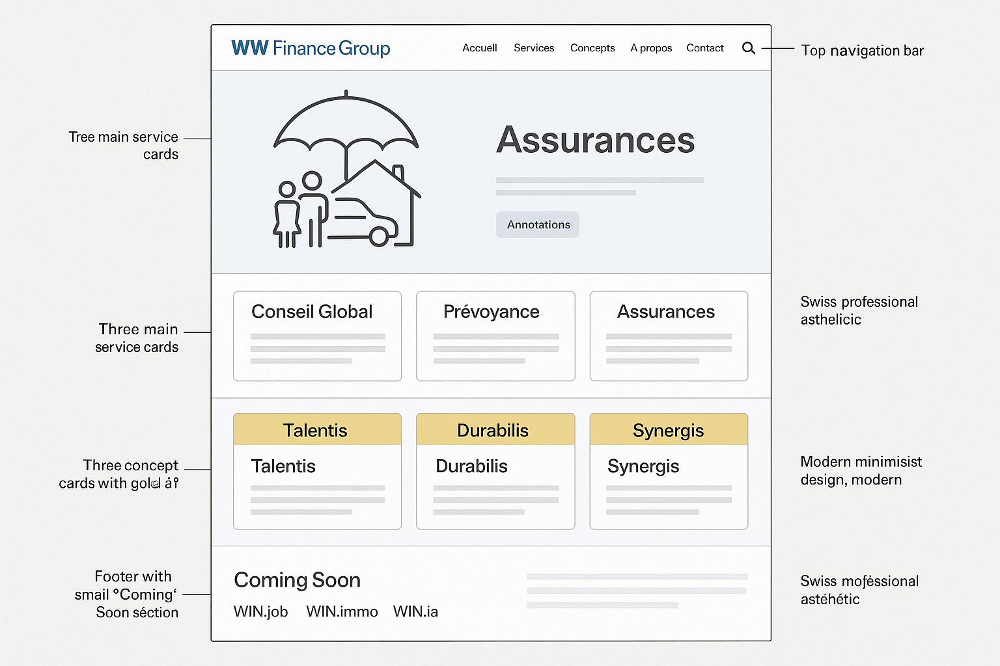

# 🎨 Maquette Site WW Finance Group

## 📐 Structure Globale



---

## 🏗️ Architecture des Pages

### 1. 🏠 PAGE D'ACCUEIL

#### **Header** (Fixe, transparent au scroll)
```
┌─────────────────────────────────────────────────────────────┐
│  [Logo WW]  Accueil  Services  Concepts  À propos  Contact │
│                                          [Espace Client] 🔐 │
└─────────────────────────────────────────────────────────────┘
```

#### **Hero Section** (Plein écran avec parallax)
```
┌─────────────────────────────────────────────────────────────┐
│                                                              │
│         WW FINANCE GROUP                                     │
│         Votre courtier en assurances de confiance           │
│                                                              │
│         [Image : Famille protégée, style moderne]           │
│                                                              │
│         [CTA : Demander un conseil gratuit]                 │
│         [CTA secondaire : Découvrir nos services]           │
│                                                              │
└─────────────────────────────────────────────────────────────┘
```

#### **Section Services** (3 cartes avec hover effects)
```
┌─────────────────────────────────────────────────────────────┐
│                   NOS SERVICES D'ASSURANCE                   │
│                                                              │
│  ┌─────────────┐  ┌─────────────┐  ┌─────────────┐        │
│  │  💼         │  │  🏦         │  │  🏢         │        │
│  │  Conseil    │  │  Prévoyance │  │  Assurances │        │
│  │  Global &   │  │  Profession-│  │  Entreprises│        │
│  │  Retraite   │  │  nelle      │  │             │        │
│  │             │  │             │  │             │        │
│  │ [En savoir +]│  │ [En savoir +]│  │ [En savoir +]│        │
│  └─────────────┘  └─────────────┘  └─────────────┘        │
└─────────────────────────────────────────────────────────────┘
```

#### **Section Concepts** (3 cartes avec accent doré)
```
┌─────────────────────────────────────────────────────────────┐
│                   NOS CONCEPTS INNOVANTS                     │
│                                                              │
│  ┌─────────────┐  ┌─────────────┐  ┌─────────────┐        │
│  │ ✨ TALENTIS │  │ 🛡️ DURABILIS│  │ 🚀 SYNERGIS │        │
│  │             │  │             │  │             │        │
│  │ Fidélisation│  │ Protection  │  │ Création    │        │
│  │ des talents │  │ des associés│  │ d'entreprise│        │
│  │             │  │             │  │             │        │
│  │ [Découvrir] │  │ [Découvrir] │  │ [Découvrir] │        │
│  └─────────────┘  └─────────────┘  └─────────────┘        │
│         (Bordure dorée #D4AF37)                             │
└─────────────────────────────────────────────────────────────┘
```

#### **Section Chiffres Clés** (Compteurs animés)
```
┌─────────────────────────────────────────────────────────────┐
│                   NOTRE EXPERTISE EN CHIFFRES                │
│                                                              │
│     [1000+]          [25 ans]          [98%]                │
│   Clients actifs   d'expérience   Satisfaction client       │
└─────────────────────────────────────────────────────────────┘
```

#### **Section CTA Final**
```
┌─────────────────────────────────────────────────────────────┐
│                                                              │
│         Prêt à protéger votre avenir ?                      │
│                                                              │
│         [Prendre rendez-vous]  [Nous contacter]            │
│                                                              │
└─────────────────────────────────────────────────────────────┘
```

#### **Footer**
```
┌─────────────────────────────────────────────────────────────┐
│  WW Finance Group                                           │
│  Bellevue 7, 2950 Courgenay                                 │
│  032 466 11 00 | contact@winwin.swiss                       │
│                                                              │
│  [Accueil] [Services] [Concepts] [Contact]                  │
│                                                              │
│  ━━━━━━━━━━━━━━━━━━━━━━━━━━━━━━━━━━━━━━━━━━━━━━━━━━━━━━  │
│                                                              │
│  🔮 Découvrez aussi nos autres activités :                  │
│  WIN.job (Recrutement) | WIN.immo (Immobilier) |            │
│  WIN.ia (Automatisation & IA)                               │
│  [Coming Soon]                                              │
│                                                              │
│  © 2024 WW Finance Group | Mentions légales | Confidentialité│
└─────────────────────────────────────────────────────────────┘
```

---

### 2. 💼 PAGE SERVICES

```
┌─────────────────────────────────────────────────────────────┐
│                   NOS SERVICES D'ASSURANCE                   │
│                                                              │
│  [Breadcrumb: Accueil > Services]                           │
│                                                              │
│  ┌─────────────────────────────────────────────────────┐   │
│  │ 💼 CONSEIL GLOBAL & PLANIFICATION RETRAITE          │   │
│  │                                                      │   │
│  │ Description détaillée du service...                 │   │
│  │ • Analyse de situation                              │   │
│  │ • Planification retraite                            │   │
│  │ • Optimisation fiscale                              │   │
│  │                                                      │   │
│  │ [Demander un conseil]                               │   │
│  └─────────────────────────────────────────────────────┘   │
│                                                              │
│  ┌─────────────────────────────────────────────────────┐   │
│  │ 🏦 PRÉVOYANCE PROFESSIONNELLE (LPP)                 │   │
│  │ ...                                                  │   │
│  └─────────────────────────────────────────────────────┘   │
│                                                              │
│  [+ 4 autres services détaillés]                            │
└─────────────────────────────────────────────────────────────┘
```

---

### 3. ✨ PAGES CONCEPTS (Talentis, Durabilis, Synergis)

**Structure identique pour chaque concept :**

```
┌─────────────────────────────────────────────────────────────┐
│                      [NOM DU CONCEPT]                        │
│                                                              │
│  [Hero avec visuel du concept]                              │
│                                                              │
│  ┌─────────────────────────────────────────────────────┐   │
│  │ 🎯 LE PROBLÈME                                       │   │
│  │ Description du problème que le concept résout       │   │
│  └─────────────────────────────────────────────────────┘   │
│                                                              │
│  ┌─────────────────────────────────────────────────────┐   │
│  │ 💡 LA SOLUTION                                       │   │
│  │ Explication détaillée du concept                    │   │
│  └─────────────────────────────────────────────────────┘   │
│                                                              │
│  ┌─────────────────────────────────────────────────────┐   │
│  │ ✅ LES AVANTAGES                                     │   │
│  │ • Avantage 1                                        │   │
│  │ • Avantage 2                                        │   │
│  │ • Avantage 3                                        │   │
│  └─────────────────────────────────────────────────────┘   │
│                                                              │
│  [CTA : Demander une présentation]                          │
└─────────────────────────────────────────────────────────────┘
```

---

### 4. 👤 PAGE À PROPOS

```
┌─────────────────────────────────────────────────────────────┐
│                      À PROPOS DE NOUS                        │
│                                                              │
│  ┌─────────────────────────────────────────────────────┐   │
│  │ [Photo Olivier Neukomm]                             │   │
│  │                                                      │   │
│  │ Olivier Neukomm                                     │   │
│  │ Courtier en assurances certifié FINMA               │   │
│  │                                                      │   │
│  │ Bio + parcours...                                   │   │
│  └─────────────────────────────────────────────────────┘   │
│                                                              │
│  ┌─────────────────────────────────────────────────────┐   │
│  │ 🎯 NOS VALEURS                                       │   │
│  │ • Transparence                                      │   │
│  │ • Expertise                                         │   │
│  │ • Proximité                                         │   │
│  └─────────────────────────────────────────────────────┘   │
│                                                              │
│  ┌─────────────────────────────────────────────────────┐   │
│  │ 🏆 CERTIFICATIONS                                    │   │
│  │ [Logos : FINMA, ARIF, etc.]                         │   │
│  └─────────────────────────────────────────────────────┘   │
└─────────────────────────────────────────────────────────────┘
```

---

### 5. 📞 PAGE CONTACT

```
┌─────────────────────────────────────────────────────────────┐
│                         CONTACTEZ-NOUS                       │
│                                                              │
│  ┌──────────────────┐  ┌──────────────────────────────┐   │
│  │                  │  │  FORMULAIRE DE CONTACT        │   │
│  │  [Carte Google]  │  │                               │   │
│  │  Maps            │  │  Nom : [_____________]        │   │
│  │                  │  │  Email : [___________]        │   │
│  │  Bellevue 7      │  │  Téléphone : [_______]        │   │
│  │  2950 Courgenay  │  │  Message : [__________]       │   │
│  │                  │  │            [__________]       │   │
│  │                  │  │                               │   │
│  │                  │  │  [Envoyer]                    │   │
│  └──────────────────┘  └──────────────────────────────┘   │
│                                                              │
│  📞 032 466 11 00                                           │
│  ✉️ contact@winwin.swiss                                    │
│  📍 Bellevue 7, 2950 Courgenay                              │
└─────────────────────────────────────────────────────────────┘
```

---

### 6. 🔐 PAGE ESPACE CLIENT

```
┌─────────────────────────────────────────────────────────────┐
│                       ESPACE CLIENT                          │
│                                                              │
│  ┌─────────────────────────────────────────────────────┐   │
│  │                                                      │   │
│  │  Accédez à votre espace client personnalisé         │   │
│  │                                                      │   │
│  │  Vous serez redirigé vers votre interface Airtable  │   │
│  │  sécurisée pour consulter :                         │   │
│  │                                                      │   │
│  │  ✅ Vos contrats d'assurance                        │   │
│  │  ✅ Vos documents                                   │   │
│  │  ✅ Vos sinistres en cours                          │   │
│  │  ✅ Vos tâches et rendez-vous                       │   │
│  │                                                      │   │
│  │  [Accéder à mon espace] → Redirection Airtable      │   │
│  │                                                      │   │
│  └─────────────────────────────────────────────────────┘   │
└─────────────────────────────────────────────────────────────┘
```

---

## 🎨 Design System

### **Couleurs**
```
Primaire :   #3176A6 (Bleu WW)
Secondaire : #8CB4D2 (Bleu clair)
Accent :     #D4AF37 (Doré)
Texte :      #1a1a1a (Noir)
Fond :       #ffffff (Blanc)
Gris :       #f5f5f5 (Fond sections)
```

### **Typographie**
```
Titres :     Inter Bold (ou Montserrat)
Corps :      Inter Regular
Taille H1 :  3.5rem (mobile: 2.5rem)
Taille H2 :  2.5rem (mobile: 2rem)
Taille H3 :  1.75rem (mobile: 1.5rem)
Corps :      1rem
```

### **Espacements**
```
Section padding : 80px (mobile: 40px)
Card padding :    32px (mobile: 24px)
Gap cards :       24px
Border radius :   12px (cards), 8px (buttons)
```

### **Effets**
```
✨ Glassmorphism sur cards
🎭 Parallax sur hero
🌊 Smooth scroll
💫 Hover effects (scale 1.05, shadow)
🎬 Animations Framer Motion (fadeIn, slideUp)
```

---

## 📱 Responsive

### **Breakpoints**
```
Mobile :  < 768px  (1 colonne)
Tablet :  768-1024px (2 colonnes)
Desktop : > 1024px (3 colonnes)
```

### **Adaptations Mobile**
- Menu burger
- Cards en colonne unique
- Textes réduits
- CTA pleine largeur
- Footer simplifié

---

## 🚀 Animations Prévues

1. **Hero** : Fade in + slide up au chargement
2. **Cards Services** : Apparition au scroll (stagger)
3. **Chiffres** : Compteurs animés au scroll
4. **Hover Cards** : Scale + shadow
5. **Transitions pages** : Fade smooth
6. **Parallax** : Background hero + sections

---

## 🔮 Mentions Futures Activités

**Dans le Footer uniquement** :
```
━━━━━━━━━━━━━━━━━━━━━━━━━━━━━━━━━━━━━━━━━━━━━━━━━━━━━━
🔮 Découvrez aussi nos autres activités :

WIN.job (Recrutement & Chasse de têtes)
WIN.immo (Courtage immobilier)
WIN.ia (Automatisation & Intelligence Artificielle)

[Coming Soon]
━━━━━━━━━━━━━━━━━━━━━━━━━━━━━━━━━━━━━━━━━━━━━━━━━━━━━━
```

**Style** : Discret, petit texte, pas de pages dédiées pour l'instant

---

## ✅ Checklist Qualité

- [ ] Design moderne et professionnel
- [ ] Responsive parfait (mobile, tablet, desktop)
- [ ] Animations fluides (Framer Motion)
- [ ] Performance optimale (images optimisées, lazy loading)
- [ ] Accessibilité (WCAG AA)
- [ ] SEO optimisé (meta tags, sitemap)
- [ ] Cross-browser compatible
- [ ] Export statique fonctionnel

---

**Cette maquette sera développée avec React 19 + Next.js + Tailwind CSS 4 + Framer Motion** 🚀
